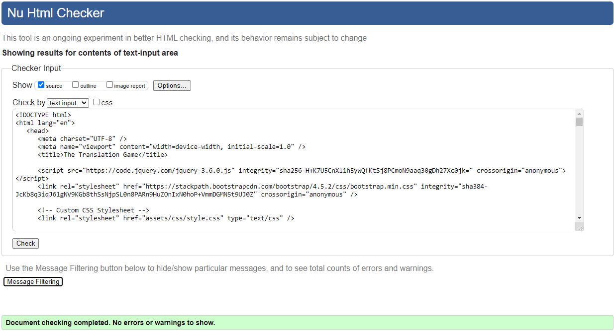
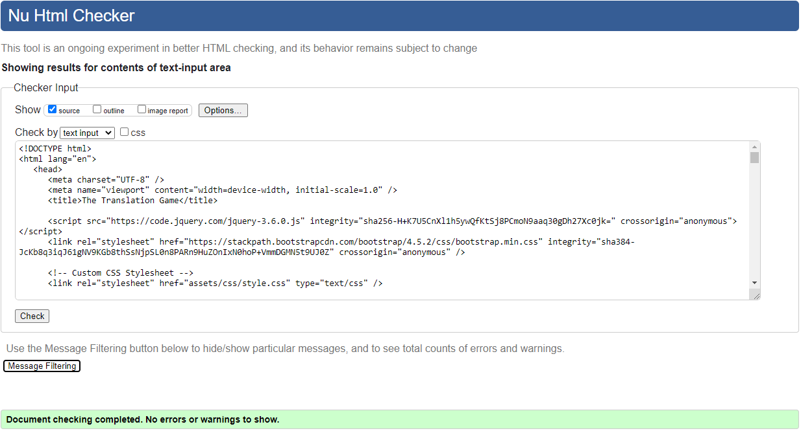
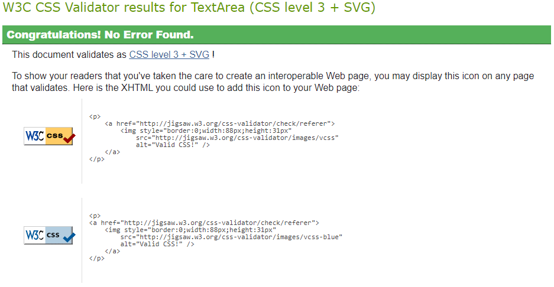
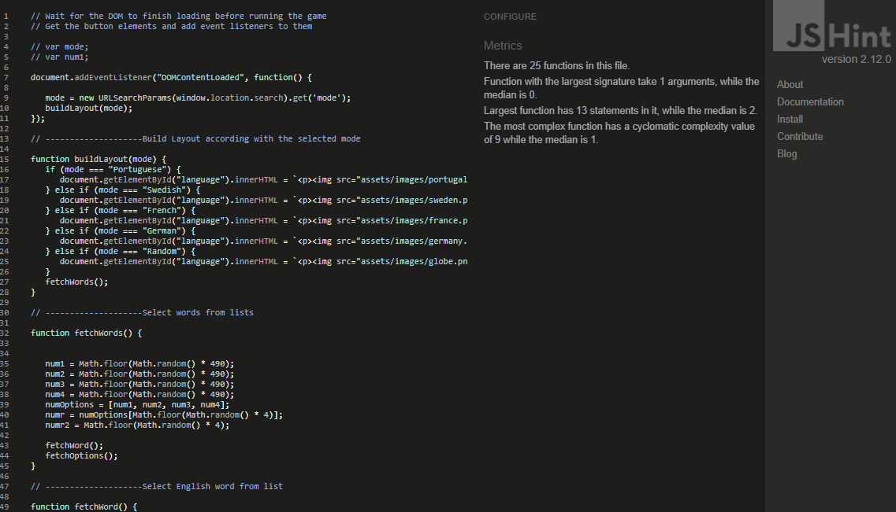
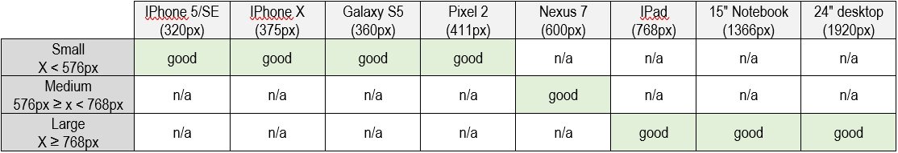

# [The Translation Game](https://ruioliveira83.github.io/MP2_Translation-Game)

## UX
The main purpose of this website is to create a didactic and funny game in a simple, easy to navigate and clean looking website.  
This website is my second milestone project for the diploma in software development from the [code institute](https://codeinstitute.net).  
A live view of this website can be found here: [The Translation Game](https://ruioliveira83.github.io/MP2_Translation-Game).

---
### User Stories
* As a regular user, I want a website responsive and good looking on all devices;
* As a regular user, I want a website easy to navigate;
* As a regular user, I want to be able to start playing the game quickly;
* As a user, I want to be able to read the game rules, if needed;
* As a user, I want to see my score;
* As a user I want to be able to see my top score;
* As a user, I want to be able to contact the developer to give my opinion or suggestion;
* As a user I want to play a funny game;
* As a user I want to repeat the experience and play again.

### Wireframes
It was used [Balsamiq](https://balsamiq.com/) to create the following wireframes:
| Desktop                                       | Tablet                                       | Mobile                                       |
| --------------------------------------------- | -------------------------------------------- | -------------------------------------------- |
| [Home](wireframes/home-desktop.png)           | [Home](wireframes/home-tablet.png)           | [Home](wireframes/home-mobile.png)           |
| [Game](wireframes/game-desktop.png)           | [Game](wireframes/game-tablet.png)           | [Game](wireframes/game-mobile.png)           |
| [Contact](wireframes/contact-desktop.png)     | [Contact](wireframes/contact-tablet.png)     | [Contact](wireframes/contact-mobile.png)     |
| [How to Play](wireframes/howTo-desktop.png)   | [How to Play](wireframes/howTo-tablet.png)   | [How to Play](wireframes/howTo-mobile.png)   |

---
## Features
### Existing Features
This website has 2 pages: **Home** and **Game**. Both pages share the same **Header**.

The **Header** has 2 Modals:
- a modal with a contact form where the user can leave a message or suggestion;
- a modal with the game rules.

The **Home** page is where the user can select the game mode.
The easy mode has 4 different options: Portuguese, Swedish, French and German.
The hard game mode has only one option: Random, where the language will be randomly selected for each new word.

The **Game** page includes a section with the score, the top score and the timer. Below that there is the word to be translated.
After that, there is information about the mode selected. At the bottom of the game area, there are 4 different words, one of 
them will be the correct translation. 

---
## Technologies Used
- [Gitpod](https://gitpod.io/)
  - IDE (Integrated Development Environment) used to develop this project.
- [GitHub](https://github.com/)
  - The code hosting platform used to host the project.
- [HTML5](https://en.wikipedia.org/wiki/HTML5)
  - The programming language used to provide content and structure.
- [CSS3](https://en.wikipedia.org/wiki/CSS)
  - The programming language used to format the styling.
- [JavaScript](https://en.wikipedia.org/wiki/JavaScript)
  - The programming language used to make the web page interactive.
- [Balsamiq](https://balsamiq.com/)
  - The software used to create the project's wireframes.
- [Bootstrap](https://getbootstrap.com/)
  - Open-source CSS framework used to create some layout features in the project.
- [Google Fonts ](https://fonts.google.com/)
  - Font families library used to provide the font "Roboto".
- [jQuery](https://en.wikipedia.org/wiki/JQuery)
  - JavaScript library used to simplify the JavaScript code.
- [W3C Markup Validator](https://validator.w3.org/)
  - The markup validation service used to check for errors in the HTML code.
- [Jigsaw](https://jigsaw.w3.org/css-validator)
  - The CSS validation service used to check for errors in the CSS code.
- [JSHint](https://jshint.com/)
  - The JavaScript validation service used to check for errors in the JavaScript code.
- [Chrome DevTools](https://developers.google.com/web/tools/chrome-devtools)
  - Chrome DevTools used to test the responsiveness of the site.
- [Responsive Design Checker](https://www.responsivedesignchecker.com/)
  - Responsive Design Checker used to test the responsiveness of the site.

---
## Testing
### Code Validators
- [HTML Validator](https://validator.w3.org/#validate_by_input) (via direct input path):
  - Home (index.html) - No errors or warnings:
  
  - Game (game.html) - No errors or warnings:
  
  
- [CSS Validator](https://jigsaw.w3.org/css-validator/#validate_by_input) (via direct input path):
  - No errors found:

- [JavaScript Validator](https://jshint.com/):
  - No errors found:

### Responsiveness of the website
It was used [Chrome DevTools](https://developers.google.com/web/tools/chrome-devtools) and
[Responsive Design Checker](https://www.responsivedesignchecker.com/)
 to test the responsiveness of the site.

The website structure adapts well to all used screen size.

### Functionality of the website
The responsiveness of all pages was tested:
- the Game Name on the top left corner returns you to the home page;
- the "Tell me what you think" modal is working and, when clicked, a working message box is shown;
- the "How to Play" modal is working and, when clicked, shows the game's rules;
- the buttons to select the game mode are working properly;
- the timer starts when the player starts to play the game;
- the score is working properly: increases the score for every correct answer and decreases the score for every wrong answer. It also starts at 0 points when the player starts a new game;
- the top score is working properly, it keeps the higher score when the player starts a new game;
- the words randomly selected are showing properly.

### Browser compatibility
The appearance and responsiveness of the website was tested with good results in 4 different web browsers: Microsoft Edge,
Mozilla Firefox, Google Chrome and Opera. This website is not compatible with Internet Explorer because it uses promises that are not supported by IE.

### Testing User Stories
* As a regular user, I want a website responsive and good looking on all devices;
  - A regular user will find a website with a balanced design and a clear structure in whatever device he chooses to use.
* As a regular user, I want a website easy to navigate;
  - A regular user will find a website with a clear structure making it easy to navigate.
* As a regular user, I want to be able to start playing the game quickly;
  - A regular user can start playing with just one click, the user just has to select the game mode.
* As a user, I want to be able to read the game rules, if needed;
  - A modal with the game rules is present on both pages and can be accessed anytime.
* As a user, I want to see my score;
  - The score is present on the game page and can be seen anytime.
* As a user I want to be able to see my top score;
  - The top score is shown above the score and can be seen anytime.
* As a user, I want to be able to contact the developer to give my opinion or suggestion;
  - A modal with a contact form is present on both pages.
* As a user I want to play a funny game;
  - The sound for correct or wrong answers make the game more fun, and the challenge of beating one's score makes the game funny and appealing.
* As a user I want to repeat the experience and play again.
  - When the game ends there is an option to play again. The game duration is only 30 seconds to make it more inviting to play "just one more" game.

## Deployment
To __deploy__ the project in GitHub I perform the following steps:
- Log into my [GitHub](https://github.com/) account;
- Choose the project "MP2_Translation-Game" on the Repositories;
- Click on Settings;
- Scroll down to the "GitHub Pages" section;
- Inside the "GitHub Pages" section, click on the drop-down menu under Source and select Master Branch;
- The page refreshes automatically and the website is now deployed.
- The link to the webpage can be found in the GitHub Pages section.

To run the code locally by __cloning__ the project from GitHub:
- Log into my [GitHub](https://github.com/) account;
- Choose the project "MP1" on the Repositories;
- Inside the Code button copy the URL link inside the Clone section;
- Open repository or create a new repository;
- Open terminal;
- Type *git clone* followed by the copied URL and press Enter.

---
## Credits
### Content
- Home Page:

- Overall structure:
  - I've looked at several projects on the code institute slack channel and, even though I didn't use any specific one as direct inspiration,
  it was helpful to see other creators ideas to help form my concept.
- Read me file:
  - I used the code institute template and followed my previous project as a guideline.

### Media
- The image used in the background was taken from [kissclipart](https://www.kissclipart.com/).
- The flags' images used in the game modes were taken from the [iconfinder](https://www.iconfinder.com/)
- The sound effects used in this website were taken from https://mixkit.co/

### Acknowledgements
- The [code institute](https://codeinstitute.net) for the inspiration and knowledge to do this website.
- The code institute [Slack](https://slack.com/) channel, for having an extensive library of questions and answer with almost all my questions.
- My mentor [Precious Ijege](https://www.linkedin.com/in/precious-ijege-908a00168/?originalSubdomain=ng) for guidance and support.